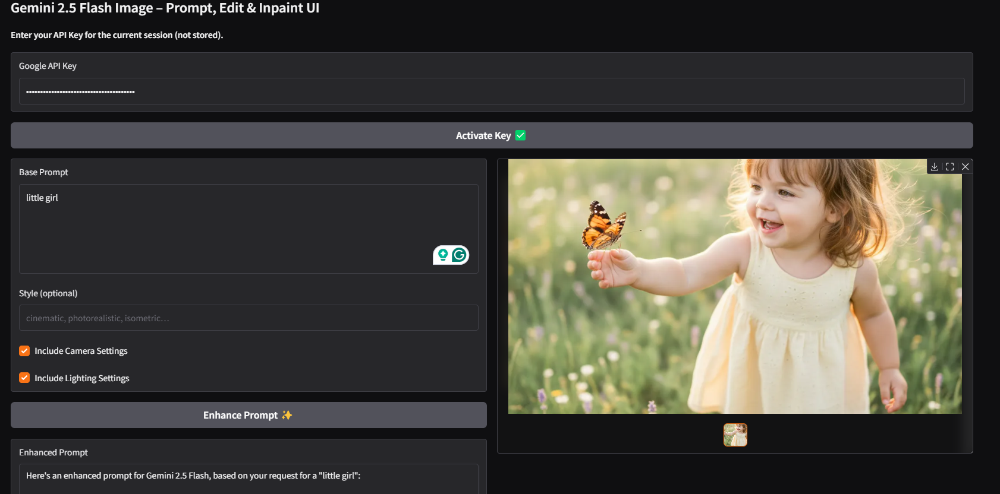
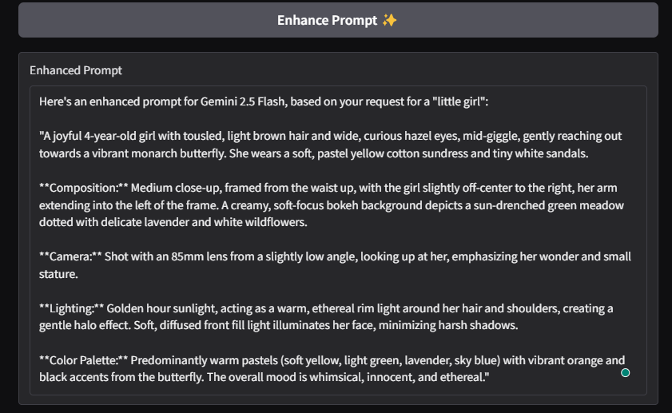
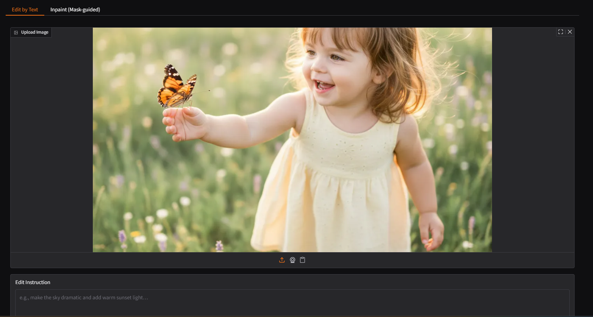
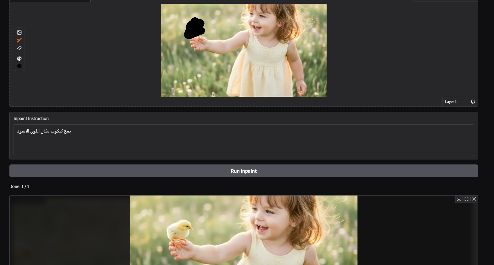

# Nano Banana Studio 🍌🎨
[](https://ko-fi.com/azidan)
[](https://codespaces.new/ahmedmah987/Nano-Banana-Studio)
[](https://vscode.dev/github/ahmedmah987/Nano-Banana-Studio)

A lightweight Gradio web UI to **enhance prompts**, **generate images**, **edit by text**, and perform **mask-guided inpaint** using Google's Gemini 2.5 Flash Image preview model.

> 🔒 Security note: The app asks for your **Google API Key** at runtime and does **not** store it on disk or in the repository.
>


---

## ✨ Features

- **In-browser API Key entry** (session-scoped)
- **Prompt Enhancer** (Gemini text model) for richer, more actionable prompts
- **Image Generation** (single or multiple results)
- **Edit by Text** (upload image + text instruction)
- **Mask-guided Inpaint** (paint WHITE where to edit)
- **Output Size / Aspect controls** (Fit/Fill, presets, or manual width/height)
- **Multi-output Gallery** for side-by-side comparison

---

## 🧰 Requirements

- **Python 3.10+**
- Packages listed in `requirements.txt`:
  ```txt
  google-genai
  gradio
  pillow
  numpy
  ```

---

## 🚀 Run Locally

### 1. Clone the repository
```bash
git clone https://github.com/ahmedmah987/Nano-Banana-Studio.git
cd Nano-Banana-Studio
```

### 2. (Recommended) Create a virtual environment
```bash
python -m venv .venv
```

Activate it:
- On **Windows (PowerShell)**:
  ```bash
  .\.venv\Scripts\Activate.ps1
  ```
- On **Linux / macOS**:
  ```bash
  source .venv/bin/activate
  ```

### 3. Install dependencies
```bash
pip install -r requirements.txt
```

### 4. Run the app
```bash
python app.py
```

Open the local URL printed in your terminal (e.g. `http://127.0.0.1:7860`).

---

## 🖼️ Usage

1. Paste your **Google API Key** in the field at the top and click **Activate Key**.
2. (Optional) Use **Enhance Prompt** to improve your base prompt.
3. Choose output controls (aspect ratio, orientation, resize mode, number of outputs).
4. Click **Generate Images** or switch to **Edit by Text** / **Inpaint** tabs.

---

## ⚙️ Options

- **Enhance Prompt**: Adds composition, camera, and lighting hints to improve model outputs.
- **Multiple Outputs**: Use the slider to generate several variants at once.
- **Aspect & Resize**:
  - **Fit (Pad)**: preserve the entire image and pad with transparency to the requested size.
  - **Fill (Crop)**: cover the requested frame and crop center overflow.
  - You can also set **Manual Width/Height**.
- **Inpaint**:
  - Paint **WHITE** on the regions you want to change.
  - Provide a concise instruction describing the desired transformation.

---

## 🔒 API Key

- The key is only held in session state.
- Do **not** share your key or enable `share=True` when running publicly.

---

## 📁 Project Structure

```
Nano-Banana-Studio/
├─ app.py
├─ requirements.txt
├─ README.md
├─ LICENSE
├─ .gitignore
└─ docs/
   ├─ screenshot-main.png
   ├─ screenshot-enhance.png
   ├─ screenshot-edit.png
   └─ screenshot-inpaint.png
```

---

## ⚠️ Notes & Limitations

- This UI changes the output size **after** generation using Pillow; it does not request a specific size from the model itself.
- Mask-guided inpainting is implemented by **sending the mask image and an explicit instruction** to restrict edits to white regions. The app does not depend on a dedicated API mask parameter.

---

## ✅ License

This project is licensed under the **MIT License** with an additional clause:

- **The software itself may not be sold** as a product or service, whether in original or modified form.  
- **Outputs generated with the software (such as images) may be used freely for personal or commercial purposes.**

See the [LICENSE](./LICENSE) file for full details.

---

## 🤝 Contributing

Pull requests are welcome. For major changes, please open an issue first to discuss what you would like to change.

---

## 🐞 Troubleshooting

- **Gallery error: `Cannot process type as image: <class 'NoneType'>`**  
  Some generations can return text only or be blocked by safety filters. The app filters invalid outputs before rendering, but if you see 0 images:
  - Soften or rephrase your prompt.
  - Try multiple outputs (e.g., 3–4) to increase chances of usable results.

- **`API error` or empty responses**  
  - Double-check your API key and quota.
  - Simplify the prompt to avoid restricted content.

---

## 📸 Screenshots

### Main Interface


### Prompt Enhancement


### Edit by Text


### Inpaint Example

